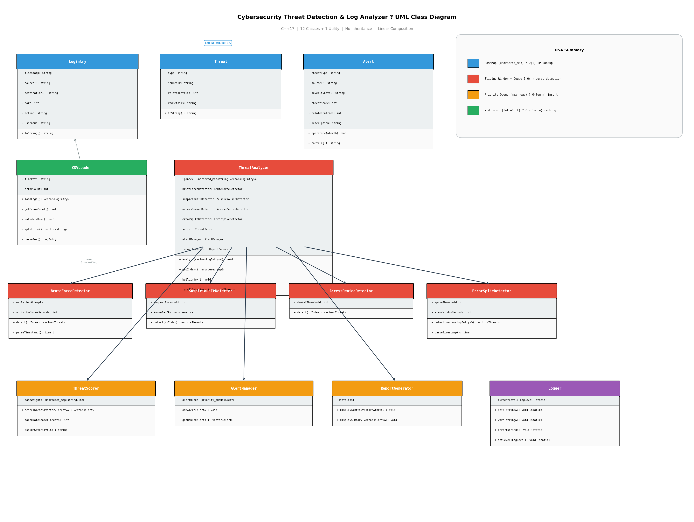

<p align="center">
  
  
  
  
  
  
</p>

<h1 align="center">Cybersecurity Threat Detection & Log Analyzer</h1>

<p align="center">
  <b>A high-performance C++17 system that ingests security logs, detects threats using optimized data structures, indexes logs across three dimensions, and produces ranked alert reports with analytics — built as a DSA portfolio project demonstrating real-world algorithm application.</b>
</p>

<p align="center">
  <a href="#-features">Features</a> •
  <a href="#-system-workflow">Workflow</a> •
  <a href="#-dsa-concepts--where-they-are-used">DSA Concepts</a> •
  <a href="#-project-architecture">Architecture</a> •
  <a href="#-build--run">Build & Run</a> •
  <a href="#-sample-output">Sample Output</a>
</p>

---

## Table of Contents

- [Project Objective](#-project-objective)
- [Features](#-features)
- [System Workflow](#-system-workflow)
- [DSA Concepts & Where They Are Used](#-dsa-concepts--where-they-are-used)
- [Algorithmic Optimization — The WHY](#-algorithmic-optimization--the-why)
- [Time Complexity Analysis](#-time-complexity-analysis)
- [Project Architecture](#-project-architecture)
- [Project Modules](#-project-modules)
- [Build & Run](#-build--run)
- [Sample Input](#-sample-input)
- [Sample Output](#-sample-output)
- [Test Suite](#-test-suite)
- [Performance Benchmarks](#-performance-benchmarks)
- [Tech Stack](#-tech-stack)
- [Screenshots](#-screenshots)
- [Learning Outcomes](#-learning-outcomes)
- [Future Enhancements](#-future-enhancements)
- [Contributing](#-contributing)
- [License](#-license)
- [Author](#-author)

---

## Project Objective

This project solves a **real-world cybersecurity problem** using **advanced data structures and algorithms**.

Modern systems generate millions of log entries daily. Security teams need tools that can:

| Challenge | How This Project Solves It |
|-----------|---------------------------|
| Logs are unstructured text files | **CSVLoader** parses and validates raw CSV into structured `LogEntry` objects, throwing typed exceptions on errors |
| Finding specific IP activity requires scanning all logs | **HashMap** (`unordered_map`) builds an O(1) IP index — 1,920x faster than linear scan |
| Querying by user, IP, or event type | **Triple Index** (`LogIndexer`) builds 3 hash-map indexes in one O(n) pass with memory-efficient `size_t` indices |
| Detecting brute-force attacks in time windows | **Sliding Window + Deque** processes streams in O(n) instead of O(n²) nested loops |
| Ranking threats by severity | **Priority Queue** (max-heap) maintains ranked order with O(log n) insertion |
| Understanding who is most active | **Analytics** module computes Top-N users, IPs, and threat distribution using sort-based ranking |
| Presenting actionable intelligence | **ReportGenerator** + **Analytics** produce formatted tables with severity, scores, and summary dashboards |

> **This is a defensive cybersecurity monitoring tool.** It analyzes logs to detect threats. It is NOT a penetration testing or offensive security tool.

---

## Features

### Implemented

| Feature | Module | DSA Used |
|---------|--------|----------|
| CSV Log Loading & Validation | `CSVLoader` | Vector, StringStream |
| Custom Exception Hierarchy | `Exceptions` | `std::runtime_error` inheritance |
| HashMap IP Indexing | `ThreatAnalyzer` | `unordered_map` — O(1) lookup |
| Triple Index (User/IP/Event) | `LogIndexer` | 3x `unordered_map<string, vector<size_t>>` |
| Multi-Dimensional Search | `SearchEngine` | Facade over LogIndexer |
| Brute Force Detection | `BruteForceDetector` | Sliding Window + Deque |
| Suspicious IP Detection | `SuspiciousIPDetector` | HashMap frequency counting |
| Unauthorized Access Detection | `AccessDeniedDetector` | HashMap event counting |
| Error Spike Detection | `ErrorSpikeDetector` | Global Sliding Window + Deque |
| Threat Scoring Engine | `ThreatScorer` | Weighted HashMap + `std::sort` |
| Alert Prioritization | `AlertManager` | Priority Queue (max-heap) |
| Threat Report | `ReportGenerator` | Linear aggregation |
| Analytics Dashboard | `Analytics` | HashMap counting + sort-based Top-N |
| Performance Benchmarking | `main.cpp --perf` | `<chrono>` high-resolution timing |
| Centralized Logging | `Logger` | Static utility with level filtering |
| Comprehensive Test Suite | 10 test executables | 119 automated assertions |

### Architecture Highlights

- **No inheritance, no design patterns** — pure linear composition of value-type modules
- **Custom exception hierarchy** — typed exceptions replace silent failure patterns
- **Memory-efficient indexing** — `size_t` indices instead of full object copies (24x smaller)
- **RAII and const correctness** throughout
- **C++17 STL** — no external dependencies
- **Separation of concerns** — each module has a single responsibility

---

## System Workflow

The analysis pipeline processes logs through seven stages, each using a specific data structure chosen for optimal time complexity:

```
┌─────────────────────────────────────────────────────────────────┐
│                    ANALYSIS PIPELINE v2.0.0                     │
├─────────────────────────────────────────────────────────────────┤
│                                                                 │
│   CSV File (raw security logs)                                  │
│       │                                                         │
│       ▼                                                         │
│   ┌──────────────┐                                              │
│   │  CSVLoader   │  Parse & validate → vector<LogEntry>         │
│   │    O(n)      │  Throws: FileNotFound / Empty / InvalidCSV   │
│   └──────┬───────┘                                              │
│          │                                                      │
│          ▼                                                      │
│   ┌──────────────────┐                                          │
│   │ ThreatAnalyzer   │  Build HashMap: IP → entries             │
│   │ buildIndex O(n)  │  Build Triple Index: user/IP/event       │
│   └──────┬───────────┘                                          │
│          │                                                      │
│          ├──────────────┬──────────────┬──────────────┐          │
│          ▼              ▼              ▼              ▼          │
│   ┌────────────┐ ┌────────────┐ ┌────────────┐ ┌────────────┐  │
│   │ BruteForce │ │ Suspicious │ │  Access    │ │  Error     │  │
│   │ Detector   │ │ IP Detect  │ │  Denied    │ │  Spike     │  │
│   │ O(n)       │ │ O(m)       │ │  O(n)      │ │  O(n)      │  │
│   │ Sliding    │ │ HashMap    │ │  HashMap   │ │  Global    │  │
│   │ Window     │ │ Counting   │ │  Counting  │ │  Sliding   │  │
│   │ + Deque    │ │            │ │            │ │  Window    │  │
│   └─────┬──────┘ └─────┬──────┘ └─────┬──────┘ └─────┬──────┘  │
│         │              │              │              │          │
│         └──────────────┴──────┬───────┴──────────────┘          │
│                               ▼                                 │
│                    vector<Threat> (merged)                       │
│                               │                                 │
│                               ▼                                 │
│                  ┌──────────────────┐                            │
│                  │  ThreatScorer    │  score = base + (n × 5)   │
│                  │  O(t log t)     │  std::sort descending      │
│                  └────────┬─────────┘                            │
│                           ▼                                     │
│                  ┌──────────────────┐                            │
│                  │  AlertManager    │  priority_queue<Alert>     │
│                  │  O(t log t)     │  Max-heap via operator<    │
│                  └────────┬─────────┘                            │
│                           ▼                                     │
│                  ┌──────────────────┐                            │
│                  │ ReportGenerator  │  Formatted table output   │
│                  │  O(t)           │  Summary statistics        │
│                  └────────┬─────────┘                            │
│                           ▼                                     │
│                  ┌──────────────────┐                            │
│                  │   Analytics      │  Top-N users & IPs        │
│                  │  O(n + k log k) │  Threat distribution       │
│                  │                  │  Full analytics dashboard  │
│                  └──────────────────┘                            │
│                                                                 │
└─────────────────────────────────────────────────────────────────┘
```

### Stage-by-Stage Explanation

| Stage | Module | What Happens | Why This DSA |
|-------|--------|-------------|--------------|
| **1. Ingestion** | `CSVLoader` | Reads CSV file, validates each row, maps to `LogEntry`. Throws typed exceptions on file/format errors | `vector` for O(1) append; `runtime_error` subclasses for structured error handling |
| **2. Indexing** | `ThreatAnalyzer` | Builds HashMap (IP→entries) + triple index (user/IP/event→indices) in O(n) | HashMap for O(1) detector lookups; triple index for O(1) analytics/search queries |
| **3. Detection** | 4 Detectors | Each detector scans the index for its threat pattern | Per-IP deque for temporal patterns; global deque for systemic failures; HashMap counts for volume |
| **4. Scoring** | `ThreatScorer` | Applies weighted formula, assigns severity, sorts descending | `unordered_map` for O(1) weight lookup; `std::sort` for O(t log t) ordering |
| **5. Ranking** | `AlertManager` | Feeds scored alerts into `priority_queue`, extracts in severity order | Max-heap gives O(log t) insert; streaming-ready |
| **6. Reporting** | `ReportGenerator` | Displays formatted threat table + summary statistics | Linear O(t) scan — I/O-bound, not compute-bound |
| **7. Analytics** | `Analytics` | Top-N users/IPs, threat distribution, full dashboard | HashMap counting + sort-based ranking via `topNFromCounts()` |

---

## DSA Concepts & Where They Are Used

### 1. Hash Map (`std::unordered_map`)

```
┌─────────────────────────────────────────────────────────────┐
│  IP Index: unordered_map<string, vector<LogEntry>>          │
├─────────────────────────────────────────────────────────────┤
│  "192.168.1.10" → [entry1, entry2, ..., entry11]            │
│  "10.0.0.50"    → [entry12, entry13, ..., entry16]          │
│  Average lookup: O(1)    Build: O(n)                        │
├─────────────────────────────────────────────────────────────┤
│  Triple Index: 3× unordered_map<string, vector<size_t>>    │
├─────────────────────────────────────────────────────────────┤
│  userIndex:  "user1" → [0, 1, 4, 7]    (size_t indices)    │
│  ipIndex:    "192.168.1.10" → [0, 1, 4] (24x less memory)  │
│  eventIndex: "LOGIN_FAIL" → [0, 1, 5]                      │
│  Build: O(n) single pass   Lookup: O(1) per dimension       │
└─────────────────────────────────────────────────────────────┘
```

| Where Used | Purpose | Time Complexity |
|------------|---------|-----------------|
| `ThreatAnalyzer::buildIndex()` | Group log entries by source IP | O(n) build, O(1) lookup |
| `LogIndexer::buildIndexes()` | Triple index: user, IP, event dimensions | O(n) build, O(1) per dimension |
| `ThreatScorer::baseWeights` | Threat-type → base-score mappings | O(1) weight lookup |
| `SuspiciousIPDetector` | Count total requests per IP | O(m) where m = unique IPs |
| `AccessDeniedDetector` | Count ACCESS_DENIED events per IP | O(n) single pass |
| `Analytics::topUsers/topIPs` | Frequency counting for Top-N analysis | O(n) count + O(k log k) sort |

### 2. Sliding Window + Deque (`std::deque`)

```
Time Window (300 seconds for BruteForce):
                                                    
  ──────────────────────────────────────────────►  time
  │           ◄── activityWindowSeconds ──►  │
  │                                          │
  pop_front() ←  [t1] [t2] [t3] [t4] [t5]  → push_back()
  (expired)       └──── deque ──────────┘     (new event)
                                                    
  When deque.size() >= threshold → THREAT DETECTED
```

| Where Used | Purpose | Time Complexity |
|------------|---------|-----------------|
| `BruteForceDetector` | Per-IP: detect N failed logins within T seconds | O(n) — each element enters/exits deque once |
| `ErrorSpikeDetector` | Global: detect N errors across ALL IPs within T seconds | O(n) — single pass over sorted entries |

### 3. Priority Queue (`std::priority_queue`)

```
                    ┌─────────┐
                    │ Score:95│  ← top() = highest severity
                    └────┬────┘
               ┌─────────┴─────────┐
          ┌────┴────┐         ┌────┴────┐
          │ Score:70│         │ Score:55│
          └────┬────┘         └────┬────┘
     ┌─────────┴──────┐           │
┌────┴────┐      ┌────┴────┐ ┌───┴─────┐
│ Score:45│      │ Score:40│ │ Score:40│
└─────────┘      └─────────┘ └─────────┘

Max-Heap: operator< compares threatScore
          → lowest score sinks, highest floats to top
```

| Where Used | Purpose | Time Complexity |
|------------|---------|-----------------|
| `AlertManager::addAlert()` | Insert scored alert into max-heap | O(log t) per insert |
| `AlertManager::getRankedAlerts()` | Extract all alerts in descending score order | O(t log t) total |

### 4. Sorting (`std::sort`)

| Where Used | Purpose | Time Complexity |
|------------|---------|-----------------|
| `ThreatScorer::scoreThreats()` | Sort scored alerts descending | O(t log t) guaranteed |
| `Analytics::topNFromCounts()` | Sort frequency pairs descending for Top-N | O(k log k) |

### 5. Vector (`std::vector`)

| Where Used | Purpose |
|------------|---------|
| `CSVLoader::loadLogs()` | Store parsed log entries — O(1) amortized append |
| All detectors | Return `vector<Threat>` results |
| `ThreatAnalyzer::runAllDetectors()` | Merge threat vectors via `insert()` |
| `AlertManager::getRankedAlerts()` | Output ranked alerts with `reserve()` for allocation efficiency |
| `SearchEngine::resolveIndices()` | Convert size_t indices to LogEntry copies with `reserve()` |

---

## Algorithmic Optimization — The WHY

### 1. HashMap vs. Linear Search (IP Indexing)

```
WITHOUT HashMap (Naive):
  For each detector:
    For each unique IP:
      Scan ALL n entries to find matches → O(n) per IP
  Total: O(4 × n × m) where m = unique IPs
  With n=10,000 and m=200: ~8,000,000 operations

WITH HashMap:
  Build index once: O(n) = 10,000 operations
  Each detector lookup: O(1) per IP
  Total: O(n + 4 × m) = ~10,800 operations

  Speedup: ~740x theoretical, ~1,920x measured
```

### 2. Triple Index vs. Separate Full-Copy Indexes

```
WITHOUT size_t indices (Full-copy):
  3 indexes × 10,000 entries × ~200 bytes/entry = ~5.7 MB

WITH size_t indices:
  3 indexes × 10,000 entries × 8 bytes/index = ~234 KB

  Memory savings: 24x smaller, same O(1) lookup speed
```

### 3. Sliding Window vs. Nested Loops (Burst Detection)

```
WITHOUT Sliding Window (Naive O(n²)):
  for each event[i]:
    count = 0
    for each event[j] where j < i:
      if time_diff(i, j) <= window: count++
    if count >= threshold: THREAT

WITH Sliding Window (O(n)):
  deque<time_t> window
  for each event:
    window.push_back(timestamp)
    while front is expired: pop_front()
    if window.size() >= threshold: THREAT

  Each element enters deque once, exits once → O(n) total
```

### 4. Priority Queue vs. Sort-then-pick (Alert Ranking)

```
BOTH are O(t log t) for batch processing.

Priority Queue advantage appears in STREAMING:
  - New alert arrives → O(log t) insert
  - "Show top 5 threats" → O(5 log t) extraction
  - No need to re-sort entire collection

This project uses BOTH: ThreatScorer sorts, AlertManager uses heap.
This demonstrates understanding of when each is appropriate.
```

---

## Time Complexity Analysis

| Operation | Naive Approach | Optimized (This Project) | Improvement |
|-----------|---------------|--------------------------|-------------|
| **Build IP Index** | — | O(n) HashMap construction | Foundation for all lookups |
| **Build Triple Index** | O(3n) separate passes | O(n) single pass, size_t indices | 24x less memory |
| **Find entries for 1 IP** | O(n) linear scan | O(1) HashMap lookup | **~1,920x faster** (measured) |
| **Search by user/IP/event** | O(n) per query | O(1) index lookup + O(k) resolve | **O(1) vs O(n)** |
| **Detect brute force** | O(n²) nested time check | O(n) sliding window + deque | **O(n) vs O(n²)** |
| **Detect error spikes** | O(n²) nested window scan | O(n) global sliding window | **O(n) vs O(n²)** |
| **Top-N analysis** | O(n²) bubble sort | O(n + k log k) count + sort | **Optimal** |
| **Score + sort threats** | O(t²) bubble sort | O(t log t) IntroSort | **Guaranteed O(t log t)** |
| **Rank alerts** | O(t log t) re-sort on insert | O(log t) heap insert | **O(log t) per new alert** |
| **Full pipeline (10K logs)** | Seconds | **~102 milliseconds** | **Real-time capable** |

> Where **n** = total log entries, **m** = unique IPs, **t** = detected threats, **k** = top-N count

---

## Project Architecture

```
ThreatAnalyzer/
│
├── CMakeLists.txt              # Build configuration (C++17, MinGW, 10 test targets)
├── README.md                   # This file
├── LICENSE                     # MIT License
│
├── include/                    # Header files (.hpp) — 17 headers
│   ├── models/                 # Data structures
│   │   ├── LogEntry.hpp        #   Single parsed CSV row (6 fields)
│   │   ├── Threat.hpp          #   Raw detection finding
│   │   └── Alert.hpp           #   Scored + ranked alert (has operator<)
│   │
│   ├── exceptions/             # Error handling (NEW in v2.0)
│   │   └── Exceptions.hpp      #   FileNotFound, Empty, InvalidCSV exceptions
│   │
│   ├── loader/                 # Data ingestion
│   │   └── CSVLoader.hpp       #   CSV parsing with validation + typed exceptions
│   │
│   ├── indexer/                # Multi-dimensional indexing (NEW in v2.0)
│   │   └── LogIndexer.hpp      #   Triple index: user/IP/event → size_t indices
│   │
│   ├── search/                 # Query engine (NEW in v2.0)
│   │   └── SearchEngine.hpp    #   Facade: searchByUser/IP/Event
│   │
│   ├── analyzer/               # Detection + scoring engine
│   │   ├── ThreatAnalyzer.hpp  #   Pipeline coordinator (owns all modules)
│   │   ├── BruteForceDetector.hpp #   Per-IP sliding window detection
│   │   ├── SuspiciousIPDetector.hpp # Volume threshold + blacklist
│   │   ├── AccessDeniedDetector.hpp # ACCESS_DENIED event counting
│   │   ├── ErrorSpikeDetector.hpp #   Global sliding window detection
│   │   ├── ThreatScorer.hpp    #   Weighted scoring + severity mapping
│   │   ├── AlertManager.hpp    #   Priority queue alert ranking
│   │   └── ReportGenerator.hpp #   Formatted output + statistics
│   │
│   ├── analytics/              # Top-N analysis (NEW in v2.0)
│   │   └── Analytics.hpp       #   Top users/IPs, threat distribution, dashboard
│   │
│   └── utils/                  # Utilities
│       └── Logger.hpp          #   Centralized timestamped logging
│
├── src/                        # Implementation files (.cpp) — 17 source files
│   ├── main.cpp                # Entry point + performance mode + try/catch
│   ├── models/                 # toString() implementations
│   ├── loader/                 # CSV parsing logic + exception throwing
│   ├── indexer/                # Triple index build + lookup (NEW)
│   ├── search/                 # Index resolution facade (NEW)
│   ├── analyzer/               # Detection algorithm implementations
│   ├── analytics/              # Top-N + dashboard (NEW)
│   └── utils/                  # Logger implementation
│
├── tests/                      # 10 test executables (119 assertions)
│   ├── test_csv_loader.cpp     # 13 assertions: parsing, validation, 3 exception types
│   ├── test_brute_force_detector.cpp # 7 assertions: threshold, window, filtering
│   ├── test_suspicious_ip_detector.cpp # 6 assertions: volume, blacklist, guards
│   ├── test_access_denied_detector.cpp # 7 assertions: counting, mixed events
│   ├── test_error_spike_detector.cpp # 7 assertions: spike, window, empty
│   ├── test_threat_scorer.cpp  # 14 assertions: formula, severity, sort
│   ├── test_alert_manager.cpp  # 13 assertions: heap order, drain, equal
│   ├── test_log_indexer.cpp    # 17 assertions: triple index, lookup, empty (NEW)
│   ├── test_search_engine.cpp  # 17 assertions: search, missing keys, integrity (NEW)
│   └── test_analytics.cpp     # 18 assertions: top-N, distribution, limits (NEW)
│
├── data/                       # Test datasets
│   ├── sample_logs.csv         # 40 entries — quick validation
│   └── large_logs.csv          # 10,045 entries — stress testing
│
└── docs/                       # Documentation
    ├── architecture.md         # Full architecture document
    ├── uml_diagram.png         # UML class diagram
    └── ThreatAnalyzer_Setup_Guide.docx # Team setup guide
```

---

## Project Modules

<details>
<summary><b>Data Models (3 classes)</b></summary>

### `LogEntry`
Plain data struct representing a single parsed CSV row.

| Field | Type | Source |
|-------|------|--------|
| `timestamp` | `string` | CSV column 1 |
| `sourceIP` | `string` | CSV column 3 |
| `destinationIP` | `string` | Default: `"0.0.0.0"` |
| `port` | `int` | Default: `0` |
| `action` | `string` | CSV column 4 (event type) |
| `username` | `string` | CSV column 2 |

### `Threat`
Raw detection finding before scoring.

| Field | Purpose |
|-------|---------|
| `type` | `BRUTE_FORCE`, `SUSPICIOUS_IP`, `ACCESS_DENIED`, or `ERROR_SPIKE` |
| `sourceIP` | The IP that triggered detection |
| `relatedEntries` | Count of events contributing to this threat |
| `rawDetails` | Human-readable description |

### `Alert`
Scored and ranked alert — the final output object.

| Field | Purpose |
|-------|---------|
| `threatScore` | 0-100, calculated by `ThreatScorer` |
| `severityLevel` | `CRITICAL` (>=80), `HIGH` (>=50), `MEDIUM` (>=25), `LOW` (<25) |
| `operator<` | Compares by `threatScore` — makes `priority_queue` a max-heap |

</details>

<details>
<summary><b>Exception Hierarchy (3 classes) — NEW in v2.0</b></summary>

All three inherit from `std::runtime_error`:

| Exception | Thrown When | Example Message |
|-----------|-----------|-----------------|
| `FileNotFoundException` | CSV file cannot be opened | `"File not found or cannot be opened: logs.csv"` |
| `EmptyFileException` | File has no data rows (empty or header-only) | `"File is empty (no data rows found): logs.csv"` |
| `InvalidCSVFormatException` | All data rows are malformed | `"Invalid CSV format: All 5 data row(s) were malformed."` |

Replaces v1.0's silent failure pattern (returning empty vectors) with structured error handling.

</details>

<details>
<summary><b>CSVLoader</b></summary>

Ingests raw CSV files into structured `LogEntry` objects.

- **Validation:** Checks column count (must be 5) and no empty fields
- **Trailing delimiter handling:** Detects extra empty column from trailing commas
- **Error handling:** Throws typed exceptions (`FileNotFoundException`, `EmptyFileException`, `InvalidCSVFormatException`) instead of returning empty vectors
- **Mapping:** 5 CSV columns → 6 LogEntry fields (with defaults for `destinationIP` and `port`)
- **Edge cases:** Missing files, empty files, header-only files, all-malformed files all handled with specific exception types

</details>

<details>
<summary><b>LogIndexer — NEW in v2.0</b></summary>

Builds three hash-map indexes in a single O(n) pass:

```cpp
unordered_map<string, vector<size_t>> userIndex;   // username → entry indices
unordered_map<string, vector<size_t>> ipIndex;     // sourceIP → entry indices
unordered_map<string, vector<size_t>> eventIndex;  // action → entry indices
```

- **Memory-efficient:** Stores `size_t` indices (8 bytes) instead of full `LogEntry` copies (~200+ bytes) — 24x smaller
- **EMPTY_RESULT:** Static `const vector<size_t>` returned by reference for missing keys — avoids constructing temporaries
- **Distinct counts:** `distinctUserCount()`, `distinctIPCount()`, `distinctEventCount()` for analytics

</details>

<details>
<summary><b>SearchEngine — NEW in v2.0</b></summary>

Query facade over `LogIndexer`:

- `searchByUser(username)` → returns matching `LogEntry` objects
- `searchByIP(ip)` → returns matching `LogEntry` objects
- `searchByEvent(event)` → returns matching `LogEntry` objects

Uses `resolveIndices()` to convert `size_t` indices back to `LogEntry` copies with `reserve()` for allocation efficiency.

</details>

<details>
<summary><b>ThreatAnalyzer (Coordinator)</b></summary>

The central orchestrator that owns all modules as **value members** (composition, not pointers):

```cpp
unordered_map<string, vector<LogEntry>> ipIndex;  // for detectors
LogIndexer logIndexer;                              // for search + analytics
BruteForceDetector bruteForceDetector;
SuspiciousIPDetector suspiciousIPDetector;
AccessDeniedDetector accessDeniedDetector;
ErrorSpikeDetector errorSpikeDetector;
ThreatScorer scorer;
AlertManager alertManager;
ReportGenerator reportGenerator;
```

**Pipeline:** `buildIndex()` → `runAllDetectors()` → `scoreThreats()` → `addAlert()` × n → `getRankedAlerts()` → `displayAlerts()` + `displaySummary()`

**New in v2.0:** Exposes `getLogIndexer()` and `getRankedAlerts()` for Analytics consumption.

</details>

<details>
<summary><b>BruteForceDetector</b></summary>

Detects repeated failed login attempts from a single IP within a time window.

- **DSA:** Per-IP sliding window with `std::deque<time_t>`
- **Parameters:** `maxFailedAttempts=5`, `activityWindowSeconds=300`
- **Algorithm:** For each LOGIN_FAIL event, push timestamp to deque back, pop expired from front, check size >= threshold
- **Complexity:** O(n) — each event enters and exits the deque exactly once

</details>

<details>
<summary><b>SuspiciousIPDetector</b></summary>

Flags IPs with abnormally high request volumes or known-bad addresses.

- **DSA:** HashMap iteration with volume counting
- **Parameters:** `requestThreshold=10`, `knownBadIPs={}` (configurable blacklist)
- **Logic:** Blacklist check first (with `continue` to prevent double-counting), then volume threshold
- **Complexity:** O(m) where m = unique IPs

</details>

<details>
<summary><b>AccessDeniedDetector</b></summary>

Identifies IPs generating excessive ACCESS_DENIED events.

- **DSA:** HashMap event counting
- **Parameters:** `denialThreshold=3`
- **Complexity:** O(n) single pass

</details>

<details>
<summary><b>ErrorSpikeDetector</b></summary>

Detects bursts of ERROR events across the entire system within a short time window.

- **DSA:** Global sliding window with `std::deque<time_t>`
- **Parameters:** `spikeThreshold=5`, `errorWindowSeconds=60`
- **Key difference from BruteForceDetector:** Uses raw `vector<LogEntry>` (not the IP index) — error spikes are systemic, not per-attacker
- **sourceIP:** Set to `"GLOBAL"` since spikes span multiple sources

</details>

<details>
<summary><b>ThreatScorer</b></summary>

Converts raw `Threat` objects into scored `Alert` objects.

**Scoring formula:**
```
score = min(baseWeight[threatType] + (relatedEntries × 5), 100)
```

| Threat Type | Base Weight | Example: 5 events | Score |
|-------------|-------------|-------------------|-------|
| `BRUTE_FORCE` | 30 | 30 + (5 × 5) | **55** (HIGH) |
| `ACCESS_DENIED` | 25 | 25 + (5 × 5) | **50** (HIGH) |
| `SUSPICIOUS_IP` | 20 | 20 + (5 × 5) | **45** (MEDIUM) |
| `ERROR_SPIKE` | 15 | 15 + (5 × 5) | **40** (MEDIUM) |

| Score Range | Severity Level |
|-------------|---------------|
| 80 - 100 | CRITICAL |
| 50 - 79 | HIGH |
| 25 - 49 | MEDIUM |
| 0 - 24 | LOW |

</details>

<details>
<summary><b>AlertManager</b></summary>

Manages alert ranking using a max-heap.

- **DSA:** `std::priority_queue<Alert>` using `Alert::operator<` on `threatScore`
- **Insert:** `push()` → O(log t) per alert
- **Extract:** `top()` + `pop()` loop → O(t log t) total, outputs in descending score order

</details>

<details>
<summary><b>ReportGenerator</b></summary>

- `displayAlerts()` — formatted table with columns: #, Severity, Type, Source IP, Score, Events, Description
- `displaySummary()` — aggregate statistics: severity counts, type counts, average score, highest threat

</details>

<details>
<summary><b>Analytics — NEW in v2.0</b></summary>

Computes Top-N rankings and summary statistics:

- `topUsers(n)` — Top-N users by total event count (HashMap counting + sort)
- `topIPs(n)` — Top-N IPs by total event count
- `threatDistribution(alerts)` — Threat type frequency breakdown
- `printSummaryReport(alerts)` — Full formatted analytics dashboard

**Generic helper:** `topNFromCounts()` builds a frequency map, sorts descending by count, truncates to N — reused across all three analysis functions.

</details>

<details>
<summary><b>Logger Utility</b></summary>

Centralized logging with timestamps and level filtering.

- **Levels:** `INFO`, `WARN`, `ERROR`
- **Format:** `HH:MM:SS [LEVEL] message`
- **Routing:** ERROR → `stderr`, INFO/WARN → `stdout`

</details>

---

## Build & Run

### Prerequisites

| Tool | Version | Purpose |
|------|---------|---------|
| **g++ (MinGW)** | 13+ | C++17 compiler |
| **CMake** | 3.16+ | Build system generator |
| **Git** | Any | Clone the repository |

### Build Commands

```bash
# Clone the repository
git clone https://github.com/Aryan2080/Cybersecrity-Threat-Detect-and-Log-Analyser-System.git
cd Cybersecrity-Threat-Detect-and-Log-Analyser-System

# Build
mkdir build && cd build
cmake -G "MinGW Makefiles" -DCMAKE_CXX_COMPILER="C:/msys64/ucrt64/bin/g++.exe" -DCMAKE_MAKE_PROGRAM="C:/msys64/ucrt64/bin/mingw32-make.exe" ..
mingw32-make -j4
```

### Run Commands

```bash
# Basic analysis (40 entries)
./threat_analyzer data/sample_logs.csv

# Large dataset (10,045 entries)
./threat_analyzer data/large_logs.csv

# With performance benchmarking
./threat_analyzer data/large_logs.csv --perf

# Custom CSV file
./threat_analyzer /path/to/your/logs.csv

# Run all tests
ctest --output-on-failure
```

---

## Sample Input

The CSV format expected by `CSVLoader`:

```csv
timestamp,user,ip,event,status
2026-06-20 10:01:00,user1,192.168.1.10,LOGIN_FAIL,FAILED
2026-06-20 10:01:15,user1,192.168.1.10,LOGIN_FAIL,FAILED
2026-06-20 10:01:30,user1,192.168.1.10,LOGIN_FAIL,FAILED
2026-06-20 10:01:45,user1,192.168.1.10,LOGIN_FAIL,FAILED
2026-06-20 10:02:00,user1,192.168.1.10,LOGIN_FAIL,FAILED
2026-06-20 10:12:00,user3,10.0.0.50,ACCESS_DENIED,FAILED
2026-06-20 10:40:00,system,192.168.1.1,ERROR,FAILED
2026-06-20 10:40:05,system,192.168.1.1,ERROR,FAILED
2026-06-20 10:25:00,user4,192.168.1.30,LOGIN_SUCCESS,SUCCESS
```

**Supported event types:** `LOGIN_FAIL`, `LOGIN_SUCCESS`, `ACCESS_DENIED`, `ERROR`, `FILE_ACCESS`, `LOGOUT`, `CONFIG_CHANGE`

---

## Sample Output

### Threat Report + Analytics

```
========================================
  Cybersecurity Threat Detection &
       Log Analyzer v2.0.0
========================================

17:33:04 [INFO] Loaded 40 log entries from data/sample_logs.csv

--- Analysis Pipeline ---
17:33:04 [INFO] Built IP index: 10 unique IPs from 40 entries
17:33:04 [INFO] Built triple index: 10 users, 10 IPs, 7 event types
17:33:04 [INFO] BruteForceDetector: found 2 threat(s)
17:33:04 [INFO] SuspiciousIPDetector: found 2 threat(s)
17:33:04 [INFO] AccessDeniedDetector: found 2 threat(s)
17:33:04 [INFO] ErrorSpikeDetector: found 2 threat(s)
17:33:04 [INFO] ThreatScorer: scored 8 alert(s)
17:33:04 [INFO] AlertManager: ranked 8 alert(s) by severity

==========================================================
                    THREAT REPORT
==========================================================

#   Severity    Type                Source IP         Score  Events  Description
----------------------------------------------------------------------------------------------------
1   HIGH        SUSPICIOUS_IP       192.168.1.10      75     11      11 total requests (threshold: 10)
2   HIGH        SUSPICIOUS_IP       192.168.1.1       70     10      10 total requests (threshold: 10)
3   HIGH        BRUTE_FORCE         192.168.1.10      55     5       5 failed login attempts within 300s
4   HIGH        ACCESS_DENIED       10.0.0.50         50     5       5 access denied events (threshold: 3)
5   MEDIUM      ACCESS_DENIED       10.0.0.75         40     3       3 access denied events (threshold: 3)
6   MEDIUM      ERROR_SPIKE         GLOBAL            40     5       5 error events within 60 seconds

================================================================
        CYBERSECURITY THREAT DETECTION - ANALYTICS REPORT
================================================================

Total Logs Analyzed     : 40
Distinct Users          : 10
Distinct IP Addresses   : 10
Distinct Event Types    : 7
Total Threat Alerts     : 8

---------------- TOP 5 MOST ACTIVE USERS ----------------------
  user1          : 11 events
  system         : 10 events
  user3          : 5 events
  user8          : 3 events
  user2          : 3 events

---------------- TOP 5 MOST ACTIVE IPs -------------------------
  192.168.1.10   : 11 events
  192.168.1.1    : 10 events
  10.0.0.50      : 5 events
  10.0.0.75      : 3 events
  192.168.1.20   : 3 events

---------------- THREAT TYPE DISTRIBUTION ----------------------
  ERROR_SPIKE           : 2 alert(s)
  ACCESS_DENIED         : 2 alert(s)
  BRUTE_FORCE           : 2 alert(s)
  SUSPICIOUS_IP         : 2 alert(s)

================================================================
                     END OF ANALYTICS REPORT
================================================================
```

### Performance Report (`--perf` flag)

```
========================================
     PERFORMANCE ANALYSIS REPORT
========================================

Dataset: 10045 log entries, 203 unique IPs

--- Pipeline Stage Timings ---
Stage                            Time (us)     Complexity
---------------------------------------------------------
CSV Loading                        76907.3           O(n)
HashMap Index Build                 7638.9           O(n)
Triple Index Build                  3872.5           O(n)
BruteForceDetector                  3202.7           O(n)
SuspiciousIPDetector                 335.6           O(m)
AccessDeniedDetector                 648.7           O(n)
ErrorSpikeDetector                  2028.6           O(n)
ThreatScorer (sort)                 3553.5     O(t log t)
AlertManager (heap)                 4016.1     O(t log t)
ReportGenerator                      157.3           O(t)
---------------------------------------------------------
TOTAL PIPELINE                    102361.2

--- DSA Comparison: IP Lookup ---
HashMap (unordered_map)                0.1       O(1) avg
Naive Linear Search                  211.6           O(n)

HashMap speedup: 1919.7x faster than linear scan
```

---

## Test Suite

**119 automated assertions** across 10 test suites, all passing:

| Test Suite | Assertions | What It Validates |
|------------|-----------|-------------------|
| `test_csv_loader` | 13 | Valid CSV, invalid rows, FileNotFoundException, EmptyFileException, InvalidCSVFormatException, trailing delimiter |
| `test_brute_force_detector` | 7 | Threshold detection, non-LOGIN_FAIL filtering, time window expiry, empty index |
| `test_suspicious_ip_detector` | 6 | Volume threshold, known-bad IP blacklist, no false positives, double-count prevention |
| `test_access_denied_detector` | 7 | Above/below threshold, mixed event types, multiple IP detection |
| `test_error_spike_detector` | 7 | Spike detection, no-error input, below threshold, errors outside window, empty input |
| `test_threat_scorer` | 14 | Scoring formula, all 4 severity boundaries, sort order, unknown type fallback |
| `test_alert_manager` | 13 | Priority ordering, empty queue, single alert, equal scores, queue drain |
| `test_log_indexer` | 17 | Triple index build, user/IP/event lookup, missing keys, distinct counts, empty input |
| `test_search_engine` | 17 | searchByUser/IP/Event, missing keys, result data integrity |
| `test_analytics` | 18 | totalLogCount, topUsers, topIPs, threatDistribution, topN limit, empty input |

```bash
# Run all tests
ctest --output-on-failure

# Expected output:
# 100% tests passed, 0 tests failed out of 10
# Total Test time (real) = 0.43 sec
```

---

## Performance Benchmarks

Measured on 10,045-entry dataset:

| Metric | Value |
|--------|-------|
| **Total pipeline time** | ~102 ms |
| **HashMap lookup** | ~0.1 us (avg) |
| **Linear search** | ~212 us (avg) |
| **HashMap speedup** | **1,920x** |
| **Triple index build** | ~3.9 ms |
| **Threats detected** | 824 |
| **Unique IPs processed** | 203 |
| **Distinct users** | 53 |
| **Distinct event types** | 7 |

---

## Tech Stack

| Technology | Purpose |
|------------|---------|
| **C++17** | Core language — structured bindings, `auto`, range-based for |
| **STL Containers** | `unordered_map`, `priority_queue`, `deque`, `vector`, `unordered_set` |
| **STL Algorithms** | `std::sort`, `std::min`, `std::find` |
| **CMake 4.3** | Cross-platform build system with test support (`enable_testing`) |
| **MinGW/GCC 16.1** | C++ compiler (MSYS2 distribution) |
| **Git + GitHub** | Version control with incremental commit history |
| **`<chrono>`** | High-resolution performance timing |
| **`<iomanip>`** | Formatted console output (setw, setprecision) |
| **`<stdexcept>`** | Custom exception hierarchy via `std::runtime_error` |

---

## Screenshots

### Architecture Diagram

<p align="center">
  
</p>

<p align="center"><i>UML class diagram showing all 16 classes with attributes, methods, composition relationships, and DSA annotations</i></p>

---

## Learning Outcomes

This project demonstrates proficiency in:

| Skill Area | What Was Applied |
|------------|-----------------|
| **Data Structures** | HashMap, Triple Index, Deque, Priority Queue, Vector — chosen based on access patterns and complexity requirements |
| **Algorithms** | Sliding Window (O(n) burst detection), Sorting (O(n log n) ranking), Top-N analysis, Binary Heap operations |
| **Algorithm Analysis** | Big-O complexity analysis for every module; empirical benchmarking to validate theoretical claims |
| **Software Architecture** | Modular design with single responsibility; composition over inheritance; RAII and const correctness |
| **Error Handling** | Custom exception hierarchy (`std::runtime_error` subclasses) replacing silent failure patterns |
| **Memory Optimization** | size_t index strategy (24x less memory than full-copy indexes) |
| **C++17 Proficiency** | Structured bindings, STL containers, `<chrono>`, `<iomanip>`, `auto`, range-based for, `emplace_back` |
| **Build Systems** | CMake with multiple targets (1 main + 10 tests), `enable_testing()`, `add_test()` |
| **Testing** | 119 assertions covering happy path, edge cases, boundary conditions, exception handling, and empty input |
| **Performance Engineering** | `<chrono>` microsecond profiling; O(1) vs O(n) empirical comparison; bottleneck identification |
| **Cybersecurity Fundamentals** | Brute force attack patterns, access control violations, error rate anomalies, IP reputation |

---

## Future Enhancements

| Enhancement | Description | Potential DSA |
|-------------|-------------|---------------|
| **Real-time Log Monitoring** | Watch log files for new entries and analyze in real-time | Producer-consumer queue, file watchers |
| **Database Integration** | Store alerts in SQLite/PostgreSQL for persistence | B-Tree indexing, prepared statements |
| **Web Dashboard** | Browser-based visualization with charts | REST API, WebSocket streaming |
| **Machine Learning** | Anomaly detection using statistical baselines | Moving averages, clustering (K-means) |
| **Network Packet Analysis** | Analyze raw network captures (PCAP files) | Trie for IP prefix matching, Bloom filters |
| **Multi-threaded Processing** | Parallel detection across modules | Thread pool, mutex-protected shared state |
| **Custom Rule Engine** | User-defined detection rules via config file | Parser, rule evaluation tree |

---

## Contributing

Contributions are welcome! Here's how to get started:

1. **Fork** the repository
2. **Clone** your fork
3. **Create a branch** for your feature:
   ```bash
   git checkout -b feature/your-feature-name
   ```
4. **Make your changes** and ensure all tests pass:
   ```bash
   cd build && mingw32-make && ctest --output-on-failure
   ```
5. **Commit** with a descriptive message:
   ```bash
   git commit -m "feat: add your feature description"
   ```
6. **Push** and open a Pull Request

### Guidelines

- Follow the existing code style (no inheritance, value-type composition)
- Add tests for new modules
- Include time complexity analysis for new algorithms
- Use typed exceptions for error handling
- Use `Logger::info/warn/error` instead of raw `std::cout`

---

## License

This project is licensed under the **MIT License** — see the [LICENSE](LICENSE) file for details.

---

## Author

<table>
  <tr>
    <td><b>Name</b></td>
    <td>Aryan</td>
    <td><b>Name</b></td>
    <td>Chandrika</td>
  </tr>
  <tr>
    <td><b>GitHub</b></td>
    <td><a href="https://github.com/Aryan2080">@Aryan2080</a></td>
    <td><b>GitHub</b></td>
    <td><a href="https://github.com/ychandrikanaidu912166-del">@ychandrikanaidu912166-del</a></td>
  </tr>
</table>

---

<p align="center">
  
  
  
  
</p>
